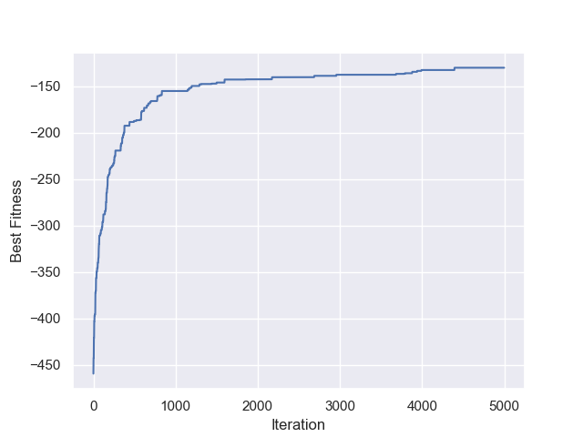
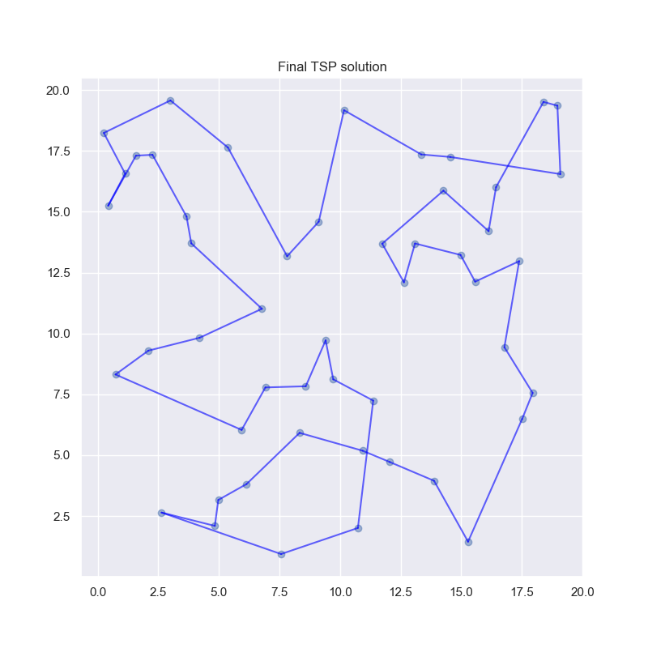

## GeneticTravelingSalesMan
Python implementation of a genetic algorithm that solves the traveling salesman person.

The following graph shows the result a genetic algorithm on a TSP with 50 cities with the following parameters:
- Order crossover
- Swap mutation with probability = 0.1
- Population size = 10
- Iterations = 5000
As you can see it converges quite quickly for a TSP with 50 cities.
This solution took ~60 seconds to compute.

