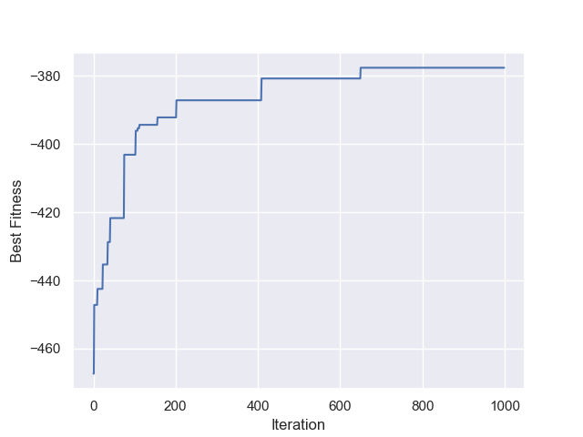
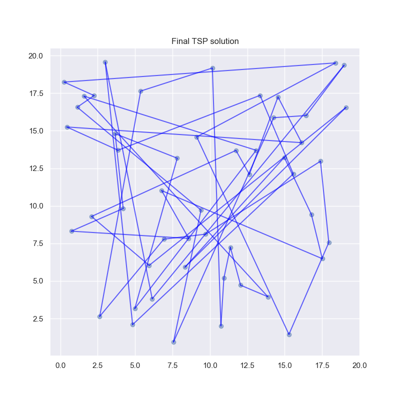

## GeneticTravelingSalesMan
Python implementation of a genetic algorithm that solves the traveling salesman person.

The following graph shows the result a genetic algorithm on a TSP with 50 cities with the following parameters:
- Order crossover
- Swap mutation with probability = 0.1
- Population size = 10
- Iterations = 5000

This solution took ~60 seconds to compute.

The following graph shows the result a memetic genetic algorithm with on a TSP with 50 cities with the following parameters:
- Order crossover
- Swap mutation with probability = 0.1
- Population size = 10
- Iterations = 1000
- Local search is swap based (2-opt https://en.wikipedia.org/wiki/2-opt) search for 10 iterations

This solution took ~4 minutes  to compute.

